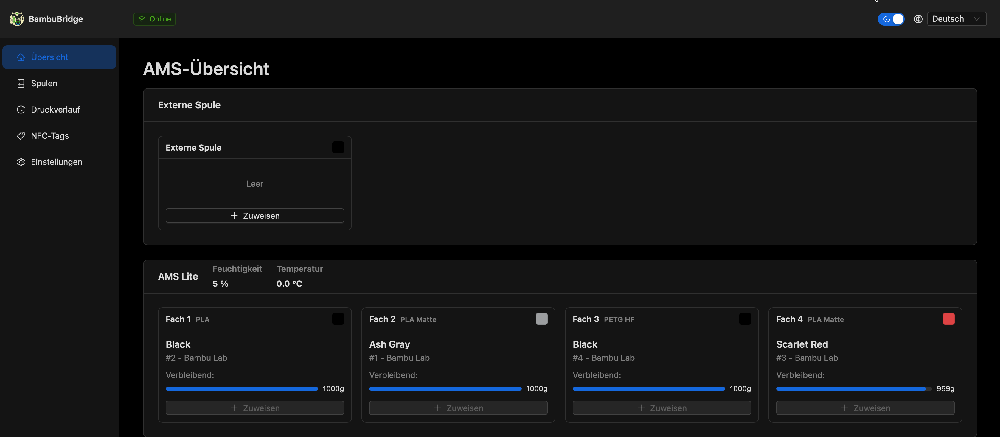

#  BambuBridge

> **Note:** This project was formerly known as "BambuBridge" and is being rebranded to "BambuBridge" to better reflect its purpose as a bridge between SpoolMan and Bambu Lab printers.

**Bambu Lab Filament Bridge** — Connect SpoolMan with Bambu Lab printers and AMS for automatic filament tracking.

BambuBridge automatically subtracts the estimated usage from the SpoolMan-managed spool records (see [AUTO SPEND](#auto-spend---automatic-filament-usage-based-on-slicer-estimate)). BambuLab filament is auto-tracked once it shows up in a tray; only third-party spools must be assigned manually through the UI.

No need for cloud or additional hardware—NFC Tags are optional and you can rely solely on the web GUI. In SpoolMan you can generate QR-code stickers that link straight back to BambuBridge so users can tap a label from their mobile device; change the base URL in SpoolMan settings to BambuBridge before generating the sticker (see [SpoolMan stickers](#spoolman-stickers)).

Similar functionality to https://github.com/spuder/OpenSpool using only your phone, server, and NFC tags integrated with SpoolMan.

Everything works locally without cloud access; you can use `scripts/init_bambulab.py` to fetch your `PRINTER_ID`/`PRINTER_CODE` if the printer does not expose them.

Docker: https://ghcr.io/xento/bambubridge

Helm: https://github.com/Xento/bambubridge/pkgs/container/bambubridge%2Fhelm%2Fbambubridge

### News
- [v0.3.0](https://github.com/Xento/bambubridge/releases/tag/v0.3.0) - 23.12.2025 — more accurate filament accounting and layer tracking, higher-fidelity print history, and better Bambu Lab / AMS integration
- [v0.2.0](https://github.com/Xento/bambubridge/releases/tag/v0.2.0) - 07.12.2025 — Adds material-aware tray/spool mismatch detection, tray color cues, print reassign/pagination, spool material filters, and SpoolMan URL handling with refreshed responsive layouts.
- [v0.1.9](https://github.com/Xento/bambubridge/releases/tag/v0.1.9) - 25.05.2025 — Ships post-print spool assignment, multi-platform Docker images, customizable spool sorting, timezone config, and compatibility/uI polish.
- [v0.1.8](https://github.com/Xento/bambubridge/releases/tag/v0.1.8) - 20.04.2025 — Starts importing each filament’s SpoolMan `filament_id` for accurate matching (requires the `filament_id` custom field).
- [v0.1.7](https://github.com/Xento/bambubridge/releases/tag/v0.1.7) - 17.04.2025 — Introduces print cost tracking, printer header info, SPA gating improvements, and fixes for drawer colors/local prints.
- [0.1.6](https://github.com/Xento/bambubridge/releases/tag/0.1.6) - 09.04.2025 — Published container images (main service + Helm chart) and packaged artifacts for easier deployments.

### Main features

#### Dashboard overview
*Overview over the trays and the assigned spools and spool information*


<details>
<summary>Desktop screenshots (expand to view)</summary>

<h4>Dashboard overview</h4>
<p>Overview over the trays and the assigned spools and spool information</p>


<h4>Fill tray workflow</h4>
<p>Assign a spool to a tray with quick filters.</p>


<h4>Print history</h4>
<p>Track every print with filament usage, used spools and costs.</p>


<h4>Spool detail info</h4>
<p>Shows informations about the spool and allows to assign it to a tray.</p>


<h4>NFC tag assignment</h4>
<p>Assign and refresh NFC tags so you can scan them with you mobile and get directly to the spool info.</p>


<h4>Spool change view from print history</h4>
<p>Change or remove the spool assignment after a print Useful when the wrong spool was assigned or the print was canceled.</p>


</details>

<details>
<summary>Mobile screenshots (expand to view)</summary>

<table>
  <tr>
    <td valign="top">
      <h4>Dashboard overview</h4>
      <p>Overview over the trays and the assigned spools and spool information</p>
      
    </td>
    <td valign="top">
      <h4>Fill tray workflow</h4>
      <p>Assign a spool to a tray with quick filters.</p>
      
    </td>
  </tr>
  <tr>
    <td valign="top">
      <h4>Print history</h4>
      <p>View recent prints, AMS slots, and filament usage anytime.</p>
      
    </td>
    <td valign="top">
      <h4>Spool detail info</h4>
      <p>Spool metadata and NFC tags are accessible on the phone.</p>
      
    </td>
  </tr>
  <tr>
    <td valign="top">
      <h4>NFC tag assignment</h4>
      <p>Assign and refresh NFC tags so you can scan them with you mobile and get directly to the spool info.</p>
      
    </td>
    <td valign="top">
      <h4>Spool change view from print history</h4>
      <p>Change or remove the spool assignment after a print Useful when the wrong spool was assigned or the print was canceled.</p>
      
    </td>
  </tr>
</table>

</details>

### What you need:
 - Android Phone with Chrome web browser or iPhone (manual process much more complicated if using NFC Tags)
 - Server to run BambuBridge with https (optional when not using NFC Tags) that is reachable from your Phone and can reach both SpoolMan and Bambu Lab printer on the network
 - Active Bambu Lab Account or PRINTER_ID and PRINTER_CODE on your printer
 - Bambu Lab printer https://eu.store.bambulab.com/collections/3d-printer
 - SpoolMan installed https://github.com/Donkie/Spoolman
 - NFC Tags (optional) https://eu.store.bambulab.com/en-sk/collections/nfc/products/nfc-tag-with-adhesive https://www.aliexpress.com/item/1005006332360160.html

### SpoolMan stickers
SpoolMan can print QR-code stickers for every spool; follow the SpoolMan label guide (https://github.com/Donkie/Spoolman/wiki/Printing-Labels) to generate them. Before printing, update the base URL in SpoolMan’s settings to point at BambuBridge so every sticker redirects to BambuBridge instead of SpoolMan.

### How to setup:

<details>
<summary>Python / venv deployment (see Environment configuration below)</summary>

1. Clone the repository and switch to the desired branch:
   ```bash
   git clone https://github.com/Xento/bambubridge.git
   cd openspoolman
   git checkout <branch>
   ```
2. Create and activate a virtual environment, then install the dependencies:
   ```bash
   python3 -m venv .venv
   source .venv/bin/activate
   pip install -r requirements.txt
   ```
3. Configure the environment variables (see below).
4. Run the server with:
   ```bash
   python wsgi.py
   ```
   BambuBridge listens on port `8001` by default so it does not clash with SpoolMan on the same host.

</details>

<details>
<summary>Docker deployment (see Environment configuration below)</summary>

1. Make sure `docker` and `docker compose` are installed.
2. Configure the environment variables (see below).
3. Copy `docker-compose.yaml` to your deployment directory (or ensure `./docker-compose.yaml` matches your environment) and adjust any host volumes or ports as needed.
4. Build and start the containers:
   ```bash
   docker compose up -d
   ```

</details>

<details>
<summary>Kubernetes (Helm) deployment (see Environment configuration below)</summary>

1. Use the bundled Helm chart under `./helm/bambubridge`:
   ```bash
   helm dependency update helm/bambubridge
   ```
2. Create a `values.yaml` (or use `helm/bambubridge/values.yaml`) that overrides the same `config.env` entries and configures an ingress with TLS for your cluster.
3. Install or upgrade the release:
   ```bash
   helm upgrade --install bambubridge helm/bambubridge -f values.yaml --namespace bambubridge --create-namespace
   ```
4. Verify the pods and ingress:
   ```bash
   kubectl get pods -n bambubridge
   kubectl describe ingress -n bambubridge
   ```

</details>

#### Environment configuration

> **Note:** Environment variables support both `BAMBUBRIDGE_*` (new) and `OPENSPOOLMAN_*` (legacy) prefixes for backwards compatibility.

- Rename `config.env.template` to `config.env` or set environment properties and:
  - set `BAMBUBRIDGE_BASE_URL` — the HTTPS URL where BambuBridge will be available on your network (no trailing slash, required for NFC writes).
  - set `PRINTER_ID` — find it in the printer settings under Setting → Device → Printer SN.
   - set `PRINTER_ACCESS_CODE` — find it in Setting → LAN Only Mode → Access Code (the LAN Only Mode toggle may stay off).
   - set `PRINTER_IP` — found in Setting → LAN Only Mode → IP Address.
   - set `SPOOLMAN_BASE_URL` — the URL of your SpoolMan installation without trailing slash. Used for UI links (menu, spool detail pages) and as the default for API calls when `SPOOLMAN_API_URL` is not set.
   - set `SPOOLMAN_UI_URL` *(optional)* — semantic alias for `SPOOLMAN_BASE_URL`; either variable satisfies the requirement. If both are set, `SPOOLMAN_BASE_URL` takes precedence.
   - set `SPOOLMAN_API_URL` *(optional)* — the URL BambuBridge uses for backend API calls to SpoolMan (without trailing slash). Defaults to `SPOOLMAN_BASE_URL`. Useful for reverse-proxy / split-horizon setups where the container reaches SpoolMan via internal DNS (e.g. `http://spoolman:8000`) while the browser needs a public hostname (e.g. `https://spoolman.example.com`).
  - set `AUTO_SPEND` to `True` to enable legacy slicer-estimate tracking (no live layer tracking).
  - set `TRACK_LAYER_USAGE` to `True` to switch to per-layer tracking/consumption **while `AUTO_SPEND` is also `True`**. If `AUTO_SPEND` is `False`, all filament tracking remains disabled regardless of `TRACK_LAYER_USAGE`.
  - set `AUTO_SPEND` to `True` if you want automatic filament usage tracking (see the AUTO SPEND notes below).
  - set `DISABLE_MISMATCH_WARNING` to `True` to hide mismatch warnings in the UI (mismatches are still detected and logged to `logs/filament_mismatch.json`, including the detected color difference when applicable).
  - set `CLEAR_ASSIGNMENT_WHEN_EMPTY` to `True` if you want BambuBridge to clear any SpoolMan assignment and reset the AMS tray whenever the printer reports no spool in that slot.
  - set `COLOR_DISTANCE_TOLERANCE` to an integer (default `40`) if you want to make the perceptual ΔE threshold for tray/spool color mismatch warnings stricter or more lenient; when either side (AMS tray or SpoolMan spool) lacks a color the warning is skipped and the UI shows "Color not set".
 - By default, the app reads `data/3d_printer_logs.db` for print history; override it through `BAMBUBRIDGE_PRINT_HISTORY_DB` (or legacy `OPENSPOOLMAN_PRINT_HISTORY_DB`) or via the screenshot helper (which targets `data/demo.db` by default).

 - Run SpoolMan.
 - Add these extra fields in SpoolMan:
   - **Filaments**
     - "type","Type","Choice", "AERO,CF,GF,FR,Basic,HF,Translucent,Aero,Dynamic,Galaxy,Glow,Impact,Lite,Marble,Matte,Metal,Silk,Silk+,Sparkle,Tough,Tough+,Wood,Support for ABS,Support for PA PET,Support for PLA,Support for PLA-PETG,G,W,85A,90A,95A,95A HF,for AMS"
     - "nozzle_temperature","Nozzle Temperature","Integer Range","°C","190 - 230"
     - "filament_id","Filament ID", "Text"
   - **Spools**
     - "tag","tag","Text"
     - "active_tray","Active Tray","Text"
 - Add your Manufacturers, Filaments and Spools to SpoolMan (consider 'Import from External' for faster workflow).
 - The filament id lives in `C:\Users\USERNAME\AppData\Roaming\BambuStudio\user\USERID\filament\base` (same for each printer/nozzle).
 - Open the server base URL in your mobile browser.
 - Optionally copy Bambu Lab RFIDs into the extra tag on spools so they match automatically; read the tag id from logs or the AMS info page.

#### Filament matching rules
- The spool's `material` must match the AMS tray's `tray_type` (main type).  
- For Bambu filaments, the AMS reports a sub-brand; this must match the spool's sub-brand. You can model this either as:
  - `material` = full Bambu material (e.g., `PLA Wood`) and leave `type` empty, **or**
  - `material` = base (e.g., `PLA`) and `type` = the add-on (e.g., `Wood`).
  Both must correspond to what the AMS reports for that tray.
- You can wrap optional notes in parentheses inside `material` (e.g., `PLA CF (recycled)`); anything in parentheses is ignored during matching.
- If matching still fails, please file a report using `.github/ISSUE_TEMPLATE/filament-mismatch.md` or temporarily hide the UI warning via `DISABLE_MISMATCH_WARNING=true` (mismatches are still logged to `logs/filament_mismatch.json`, and color mismatches also capture the computed color distance).

With NFC Tags:
 - For non-Bambu filament, select it in SpoolMan, click 'Write,' and tap an NFC tag near your phone (allow NFC).
 - Attach the NFC tag to the filament.
 - Load the filament into AMS, then bring the phone near the NFC tag so it opens BambuBridge.
 - Assign the AMS slot you used in the UI.

Without NFC Tags:
 - Click 'Fill' on a tray and select the desired spool.
 - Done.

### Accessing BambuBridge
Once the server is running (via `wsgi.py`, Gunicorn, Docker, or Helm), open `https://<host>:8443` if you used the built-in adhoc SSL mode, or `http://<host>:8001` when the service listens on the default port 8001. Replace `<host>` with your server's IP/DNS and ensure the port matches your chosen deployment (`PORT` env var or docker-compose mapping). For Docker deployments, you can also use `docker compose port bambubridge 8001` to see the mapped host port.
### AUTO SPEND - Automatic filament usage based on slicer estimate
You can turn this feature on to automatically update the spool usage in SpoolMan. 
This feature is using slicer information about predicted filament weight usage (and in future correlating it with the progress of the printer to compute the estimate of filament used).

This feature has currently following issues/drawbacks:
 - Spending on the start of the print
 - Not spending according to print process and spending full filament weight even if print fails
 - Don't know if it works with LAN mode, since it downloads the 3MF file from cloud
 - Not tested with multiple AMS systems
 - Not handling the mismatch between the SpoolMan and AMS (if you don't have the Active Tray information correct in spoolman it won't work properly)

### Notes:
 - If you change the BASE_URL of this app, you will need to reconfigure all NFC TAGS

### TBD:
 - Filament remaining in AMS (I have only AMS lite, if you have AMS we can test together)
 - Filament spending based on printing
   - TODO: handle situation when the print doesn't finish
   - TODO: test with multiple AMS
 - Code cleanup
 - Video showcase
 - Docker compose SSL
 - TODOs
 - Reduce the amount of files in docker container
 - Cloud service for controlled redirect so you don't have to reconfigure NFC tags
 - QR codes
 - Add search to list of spools
